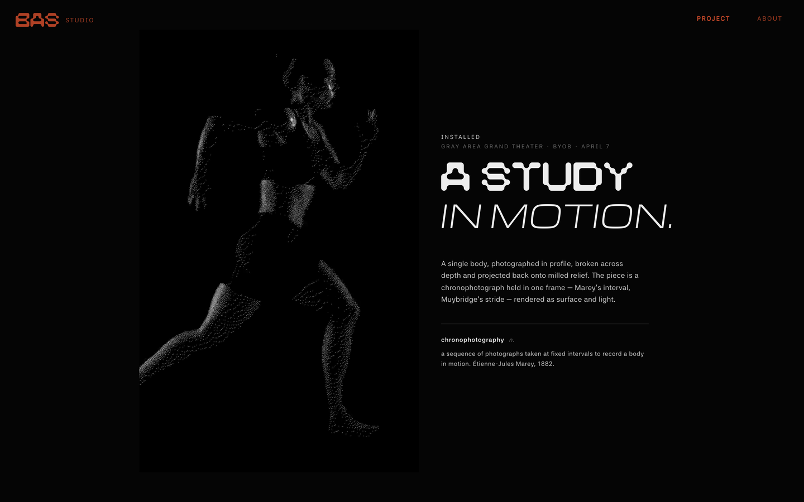
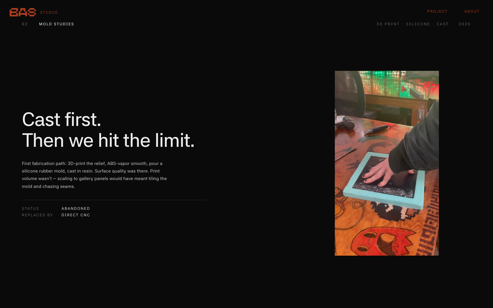
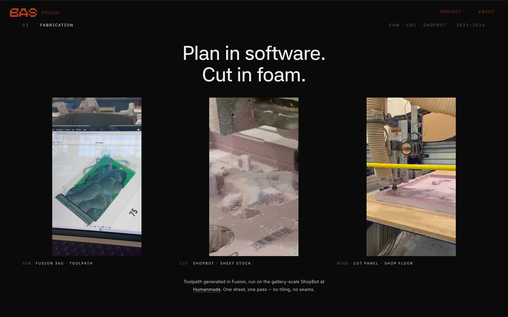
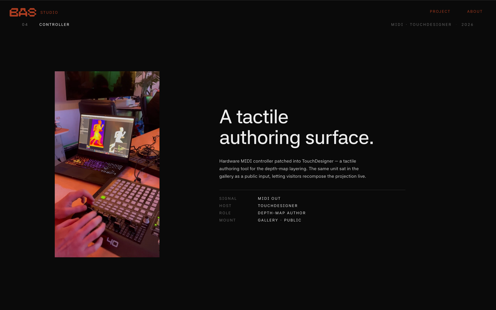
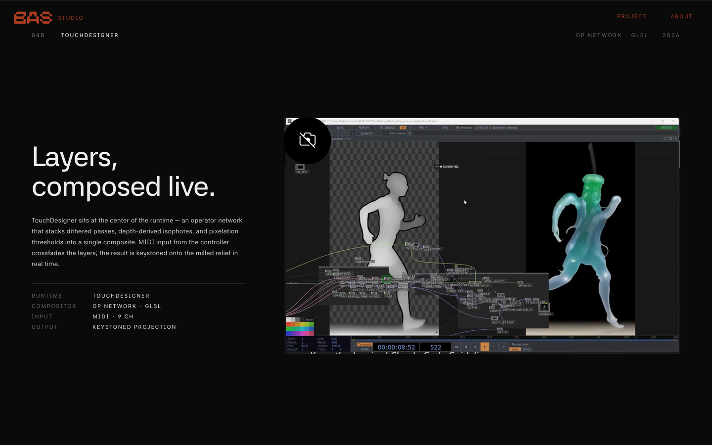
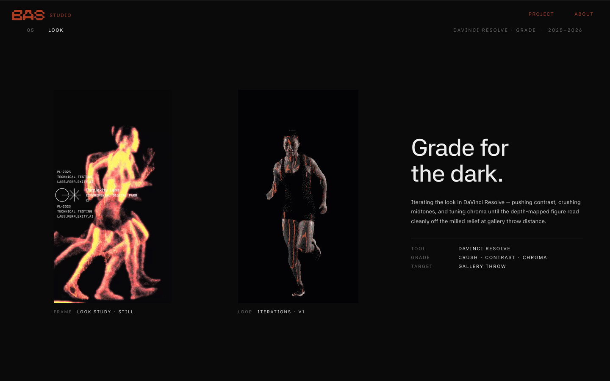
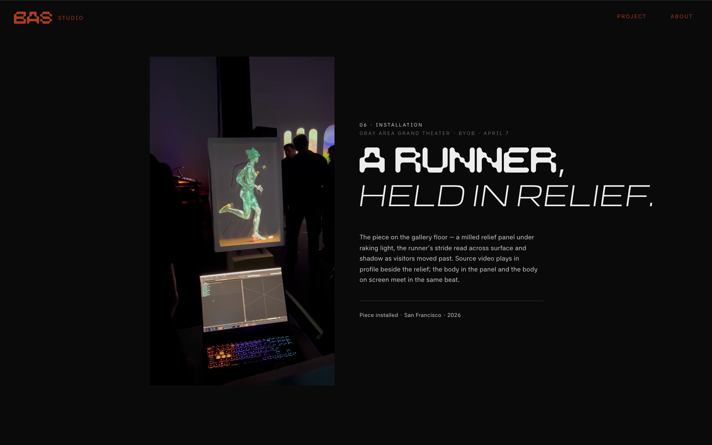

# A STUDY IN MOTION

A single-page site for **A STUDY IN MOTION** — a chronophotography relief installation by [BAS STUDIO](https://bas.run/). One runner, photographed in profile and broken across depth, milled into a stone-like panel and read by light. The site opens on a torchlit WebGL relief you can move the light across with your cursor, then snaps through the project's build, from mold studies to the gallery floor.

**→ Live at [bas.run](https://bas.run/)**

<video src="https://github.com/connerkward/bas-web/raw/main/media/hero.mp4" autoplay loop muted playsinline width="100%"></video>

*The torchlit WebGL hero — move the cursor to drag the light across the relief. ([animated GIF](media/hero.gif) · [MP4](media/hero.mp4) if the video above doesn't play.)*

---

## The piece

> A single body, photographed in profile, broken across depth and projected back onto milled relief. The piece is a chronophotograph held in one frame — Marey's interval, Muybridge's stride — rendered as surface and light.

Installed at **Gray Area Grand Theater**, San Francisco (BYOB, April 7). The gallery piece is a milled relief panel under raking light; a runner's stride is read across surface and shadow as visitors move past, while the source video plays in profile beside it.



---

## The build

The site walks through the pipeline that produced the installation.

### 02 — Mold studies


### 03 — Fabrication
Toolpath generated in Fusion 360, run on a gallery-scale ShopBot. One sheet, one pass — no tiling, no seams.


### 04 — Controller
A hardware MIDI controller patched into TouchDesigner — a tactile authoring surface that also sat in the gallery as a public input, letting visitors recompose the projection live.


### 04A — TouchDesigner
An operator network stacks dithered passes, depth-derived isophotes, and pixelation thresholds into a single composite, keystoned onto the milled relief in real time.


### 05 — Look
Graded in DaVinci Resolve — pushing contrast, crushing midtones, and tuning chroma until the depth-mapped figure reads cleanly off the relief at gallery-throw distance.


### 06 — Installation


---

## The site itself

A full-page snap site — hero, feature page, six project steps, footer — that aims for the native iOS card-swipe feel.

- **Torchlit WebGL hero** built with [React Three Fiber](https://r3f.docs.pmnd.rs/). A milled-relief mesh (a Draco-compressed GLB, decimated from a 3.1M-tri STL down to ~120k tris / ~300 KB) sits under a single cursor-tracked point light. The light flickers like a candle, fades in as the cursor enters, and the whole scene rises from flat on first load. ACES filmic tone mapping and a film-grain pass finish it.
- **Mandatory CSS scroll-snap** for the firm, native swipe between sections — with a small JS helper to work around an iOS Safari snap bug on programmatic navigation.
- **Per-section reveal cascades** and a per-letter footer wordmark animation.

Built with **React + TypeScript + Vite**, **Three.js / React Three Fiber**, and `@react-three/postprocessing`.

> Implementation notes — the iOS-specific snap workarounds, viewport-height handling, and the camera zoom-to-fit — live in [`CLAUDE.md`](CLAUDE.md). Each note maps to a real debugging cycle; read it before "simplifying" anything in the nav/snap path.

---

## Develop

```bash
npm install
npm run dev          # Vite dev server (add -- --host to expose on the LAN)
npm run build        # production build to dist/
npx tsc -b --noEmit  # type-check
```

## Deploy

Hosted on **GitHub Pages**, DNS on **Cloudflare**.

- `.github/workflows/deploy.yml` builds and publishes `dist/` to Pages on every push to `main`.
- `public/CNAME` binds the custom domain `bas.run`; the four Cloudflare `A` records for the apex must stay **gray-cloud (DNS only)** so GitHub can provision the TLS cert.

## Credits

**Conner Ward** · **Nick Eschen** — San Francisco, 2026.
